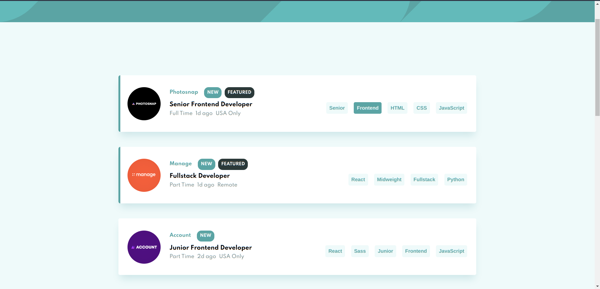

# Frontend Mentor - Job listings with filtering solution

This is a solution to the [Job listings with filtering challenge on Frontend Mentor](https://www.frontendmentor.io/challenges/job-listings-with-filtering-ivstIPCt). Frontend Mentor challenges help you improve your coding skills by building realistic projects.

## Overview

### The challenge

Your challenge is to build out this job listing page and get it looking as close to the design as possible.

You can use any tools you like to help you complete the challenge. So if you've got something you'd like to practice, feel free to give it a go.

Users should be able to:

- View the optimal layout for the site depending on their device's screen size
- See hover states for all interactive elements on the page
- Filter job listings based on the categories

### Links

- Solution URL: [solution](https://github.com/AlecANL/jobs-listings-react)
- Live Site URL: [demo](https://app-jobs-listing.netlify.app/)

### Built with

- Semantic HTML5 markup
- CSS custom properties
- Flexbox
- CSS Grid
- Mobile-first workflow
- [React](https://reactjs.org/) - JS library

## Author

- Frontend Mentor - [@AlecANL](https://www.frontendmentor.io/profile/AlecANL)
- Twitter - [@Alexei_Alvarez4](https://www.twitter.com/Alexei_Alvarez4)
